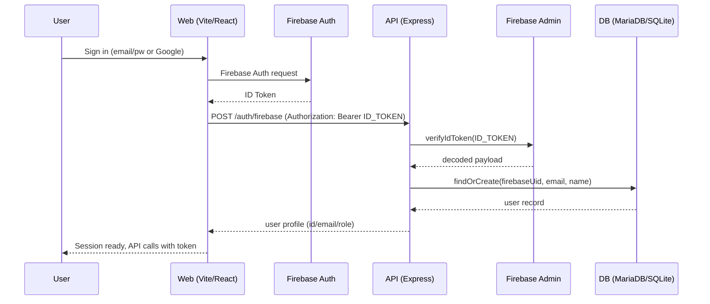

# Architecture

## Sequence: Firebase Login → Backend Sync


## Deployment (Docker on EC2)
```mermaid
graph TD
  user[Browser] -->|HTTPS| nginx[Nginx (host)]
  nginx -->|/ static + /api proxy| web[web container (nginx + Vite build)]
  nginx -->|/api| backend[backend container (Express)]
  backend --> db[(MariaDB volume)]
  subgraph docker_compose
    web
    backend
    db
  end
```

## Components
- **Frontend**: React/Vite + Firebase Web SDK, built to static assets served by Nginx. Axios interceptor attaches Firebase ID token.
- **Backend**: Express/TypeScript + Sequelize. Firebase Admin verifies ID tokens, maps users to DB. Winston + daily rotate for logs.
- **DB**: MariaDB (prod) / SQLite (dev). Models cover users, campsites, reservations, reviews.
- **Infra**: Docker Compose stack, systemd unit for autorestart, Nginx reverse proxy for `/api` to backend and static hosting.
